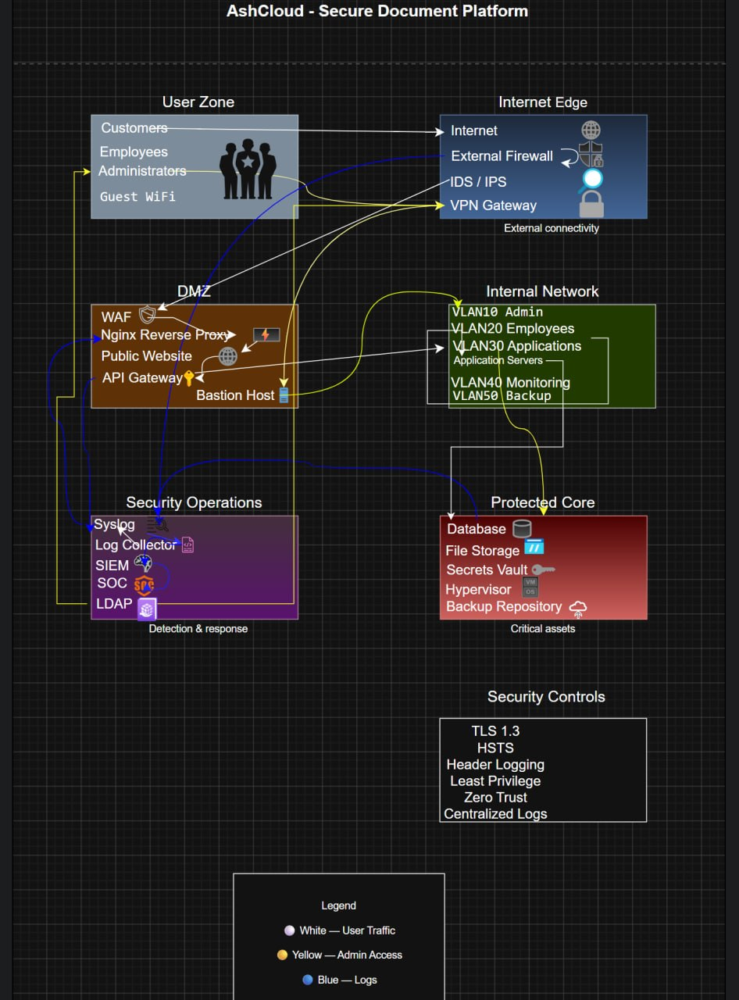

# AshCloud — Secure Document Platform

---

# Цель работы

Спроектировать базовую инфраструктуру компании и показать основные механизмы защиты сети.

В рамках задания была разработана архитектура SaaS-платформы для хранения документов с разделением сетевых зон, организацией безопасного доступа, централизованным логированием и базовыми принципами защиты инфраструктуры.

---

# Описание компании

AshCloud — условная SaaS (Software as a Service) платформа для хранения и обработки документов.

Пользователи получают доступ к веб-приложению через интернет.

Административный доступ осуществляется отдельно через VPN и выделенную точку входа.

---

# Архитектура инфраструктуры

Инфраструктура разделена на отдельные зоны доверия.

## User Zone

Назначение:

Зона пользователей системы.

Содержит:

- Customers
- Employees
- Administrators
- Guest WiFi

Описание:

- Customers используют публичный веб-интерфейс.
- Employees работают внутри компании.
- Administrators получают доступ только через VPN.
- Guest WiFi полностью изолирован.

---

## Internet Edge

Назначение:

Пограничный уровень между интернетом и компанией.

Содержит:

- Internet
- External Firewall
- IDS / IPS
- VPN Gateway

### Термины

Firewall — устройство фильтрации сетевого трафика.

IDS — Intrusion Detection System.

Система обнаружения атак.

IPS — Intrusion Prevention System.

Система предотвращения атак.

VPN — Virtual Private Network.

Защищённый удалённый доступ.

---

## DMZ

DMZ = Demilitarized Zone

Демилитаризованная зона.

Назначение:

Размещение сервисов, доступных извне.

Содержит:

- WAF
- Nginx Reverse Proxy
- Public Website
- API Gateway
- Bastion Host

### Термины

WAF — Web Application Firewall.

Защищает веб-приложения от атак.

Nginx Reverse Proxy:

Принимает HTTPS-запросы и перенаправляет их внутрь сети.

Bastion Host:

Контролируемая точка административного доступа.

---

## Internal Network

Назначение:

Разделение внутренних сервисов.

Используются VLAN.

VLAN = Virtual Local Area Network.

Содержит:

- VLAN10 Admin
- VLAN20 Employees
- VLAN30 Applications
- Application Servers
- VLAN40 Monitoring
- VLAN50 Backup

---

## Protected Core

Назначение:

Хранение критичных данных.

Содержит:

- Database
- File Storage
- Secrets Vault
- Hypervisor
- Backup Repository

### Термины

Secrets Vault:

Хранилище секретов:

- сертификаты;
- пароли;
- токены;
- ключи.

Hypervisor:

Платформа управления виртуальными машинами.

---

## Security Operations

Назначение:

Мониторинг и обнаружение инцидентов.

Содержит:

- Syslog
- Log Collector
- SIEM
- SOC
- LDAP

### Термины

Syslog:

Централизованный сбор логов.

SIEM — Security Information and Event Management.

Анализирует события безопасности.

SOC — Security Operations Center.

Команда мониторинга безопасности.

LDAP — Lightweight Directory Access Protocol.

Каталог пользователей и управление доступом.

---

# Потоки взаимодействия

## Пользовательский поток

Customers

↓

Internet

↓

External Firewall

↓

IDS / IPS

↓

WAF

↓

Nginx Reverse Proxy

↓

Public Website

↓

API Gateway

↓

Application Servers

↓

Database

---

## Административный доступ

Administrators

↓

VPN Gateway

↓

Bastion Host

↓

VLAN10 Admin

---

## Логирование

External Firewall

↓

Syslog

↓

Log Collector

↓

SIEM

↓

SOC

---

# Контроль безопасности

Используются:

- TLS 1.3
- HSTS
- Header Logging
- Least Privilege
- Zero Trust
- Centralized Logs

### Расшифровка

TLS — Transport Layer Security

Шифрование соединения.

HSTS — HTTP Strict Transport Security

Принудительное использование HTTPS.

Least Privilege

Минимально необходимые права.

Zero Trust

Никому не доверять автоматически.

Centralized Logs

Централизованный сбор журналов.

---

# Логируемые HTTP-заголовки

Через Reverse Proxy предполагается сбор:

- Host
- User-Agent
- X-Forwarded-For
- X-Real-IP
- TLS Version
- Status
- Request Time

---

# Практическая ценность

Данная архитектура демонстрирует:

- сегментацию сети;
- защиту периметра;
- безопасное администрирование;
- централизованный сбор событий;
- подготовку инфраструктуры к мониторингу и расследованию инцидентов.

---

# Итог

Была разработана защищённая архитектура SaaS-платформы с применением современных принципов сетевой безопасности и разделения доступа.
