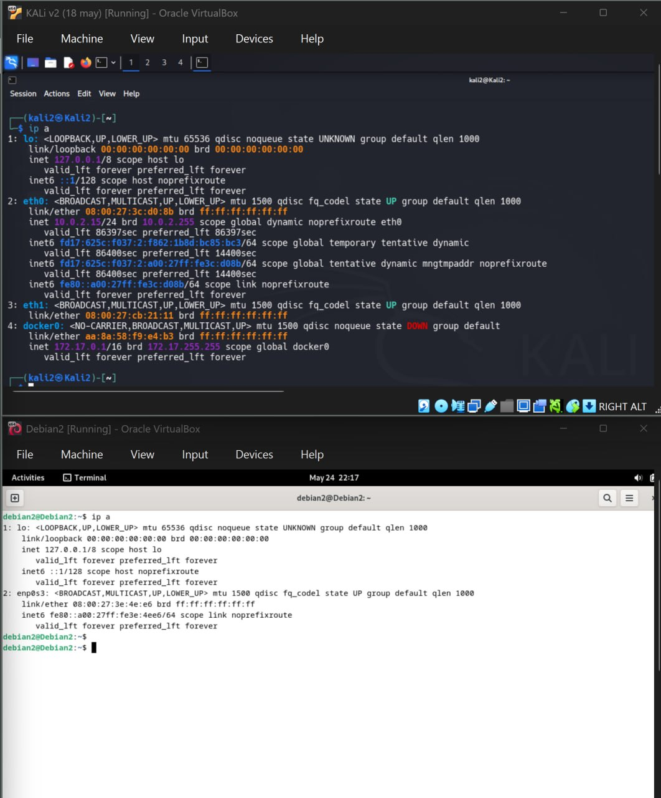
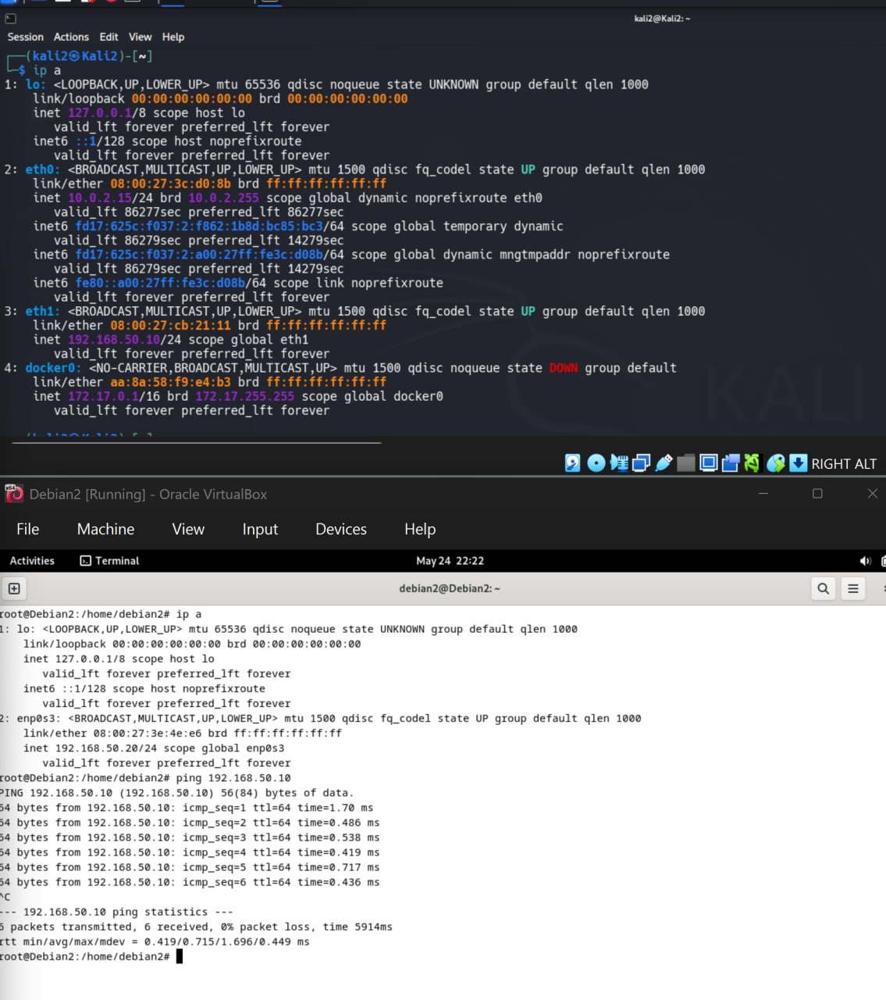
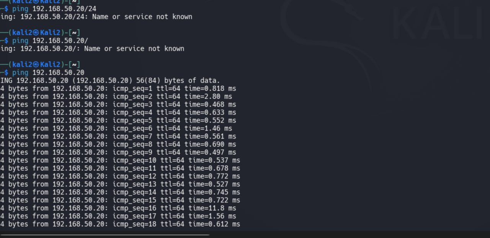
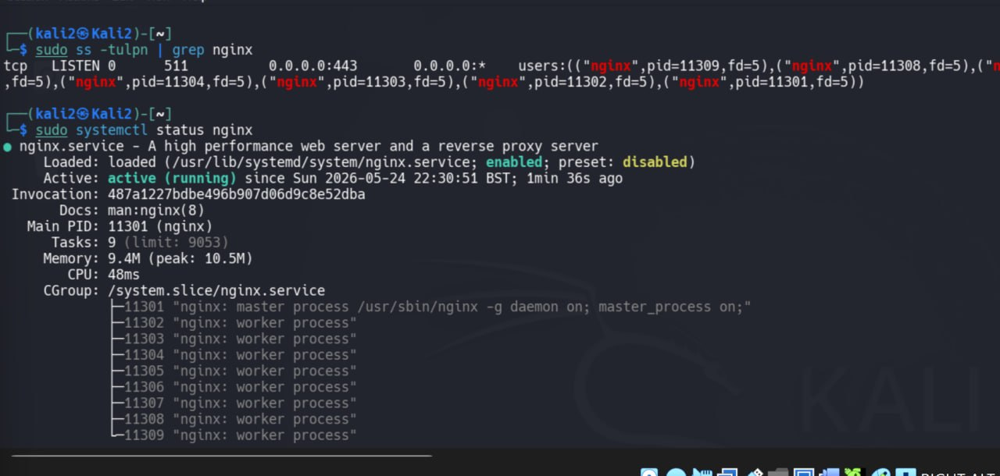
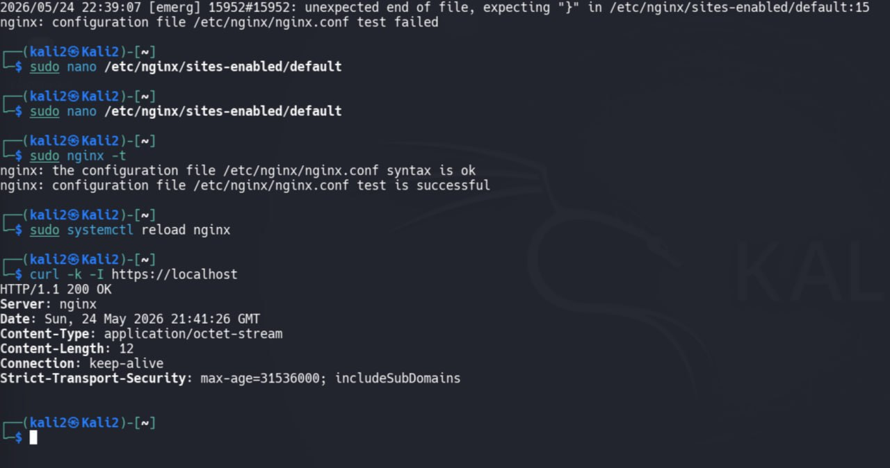
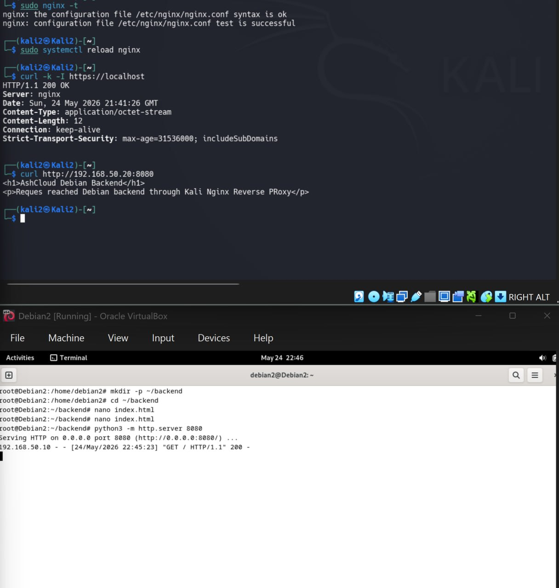
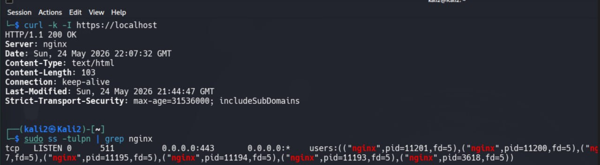

# Lab 2 — Nginx Reverse Proxy, HTTPS and Backend Connectivity



---

# Цель работы

В данной лабораторной работе была выполнена настройка защищённого доступа между двумя виртуальными машинами.

Архитектура:

Client (Kali Linux)
↓
Nginx Reverse Proxy
↓
Debian Backend Server

Были изучены:

- настройка сетевой связности;
- настройка Reverse Proxy;
- запуск backend сервиса;
- настройка HTTPS;
- применение HSTS;
- проверка работы веб-сервера.

---

# Используемые технологии

| Инструмент | Назначение |
|---|---|
| Kali Linux | Reverse Proxy |
| Debian | Backend сервер |
| Nginx | Веб сервер и Reverse Proxy |
| Python HTTP Server | Тестовый backend |
| curl | Проверка HTTP/HTTPS |
| ip | Проверка сетевых интерфейсов |
| ss | Проверка открытых портов |

---
# Lab 2 — Nginx Reverse Proxy, HTTPS and Backend Connectivity


---

# Цель работы

В данной лабораторной работе была выполнена настройка защищённого взаимодействия между двумя виртуальными машинами с использованием Nginx Reverse Proxy.

Архитектура работы:

Client (Kali Linux)
↓
Nginx Reverse Proxy
↓
Debian Backend Server

В ходе выполнения были изучены:

- настройка сетевой связности;
- проверка доступности узлов;
- запуск backend сервера;
- настройка Reverse Proxy;
- настройка HTTPS;
- применение политики HSTS;
- проверка прохождения запросов.

---

# Используемые инструменты

| Инструмент | Назначение |
|---|---|
| Kali Linux | Reverse Proxy сервер |
| Debian | Backend сервер |
| Nginx | Web Server и Reverse Proxy |
| Python HTTP Server | Тестовый backend |
| curl | Проверка HTTP/HTTPS |
| ip | Анализ сетевых интерфейсов |
| ss | Проверка открытых портов |

---

# Что такое Reverse Proxy

Reverse Proxy — это промежуточный сервер между клиентом и backend.

Пользователь отправляет запрос:

Client → Nginx

После этого Nginx самостоятельно пересылает запрос:

Nginx → Backend

Основные преимущества:

- скрытие backend инфраструктуры;
- централизованное шифрование HTTPS;
- дополнительный уровень безопасности;
- контроль маршрутизации запросов.

---

# Шаг 1. Проверка сетевой конфигурации

Сначала была проверена конфигурация сетевых интерфейсов.

Команда на Kali:

```bash
ip a
```

Результат:

```text
eth1
192.168.50.10/24
```

Команда на Debian:

```bash
ip a
```

Результат:

```text
enp0s3
192.168.50.20/24
```

Подтверждено нахождение машин в одной подсети.

---

Скриншот:



---

# Шаг 2. Проверка сетевой связности

Для проверки соединения использовался ICMP (Internet Control Message Protocol).

Команда:

```bash
ping 192.168.50.20
```

Результат:

```text
0% packet loss
```

Установлено успешное соединение между Kali и Debian.

---

Скриншот:



---

# Шаг 3. Проверка запуска Nginx

Проверка состояния сервиса:

```bash
sudo systemctl status nginx
```

Проверка открытого порта:

```bash
sudo ss -tulpn | grep nginx
```

Получен результат:

```text
0.0.0.0:443
```

Это подтверждает запуск HTTPS сервера.

---

Скриншоты:





---

# Шаг 4. Настройка HTTPS

После изменения конфигурации была выполнена проверка.

Проверка конфигурации:

```bash
sudo nginx -t
```

Перезагрузка сервиса:

```bash
sudo systemctl reload nginx
```

Проверка HTTPS:

```bash
curl -k -I https://localhost
```

Получен ответ:

```text
HTTP/1.1 200 OK
```

Также появился заголовок:

```text
Strict-Transport-Security
```

---

# Что такое HSTS

HSTS (HTTP Strict Transport Security) — механизм безопасности браузера.

Назначение:

- запрещает переход на HTTP;
- принудительно использует HTTPS;
- защищает от downgrade attack.

Полученный заголовок:

```text
Strict-Transport-Security: max-age=31536000; includeSubDomains
```

Значение:

- 31536000 секунд ≈ 1 год;
- правило применяется ко всем поддоменам.

---

Скриншот:



---

# Шаг 5. Настройка и проверка Backend

На Debian был создан backend.

Создание каталога:

```bash
mkdir -p ~/backend
cd ~/backend
```

Создание страницы:

```bash
nano index.html
```

Содержимое:

```html
<h1>AshCloud Debian Backend</h1>

<p>Request reached Debian backend through Kali Nginx Reverse Proxy</p>
```

Запуск backend:

```bash
python3 -m http.server 8080
```

---

Скриншот:



---

# Шаг 6. Проверка прохождения запроса

С Kali выполнена проверка доступа:

```bash
curl http://192.168.50.20:8080
```

Получен ответ:

```html
<h1>AshCloud Debian Backend</h1>

<p>Request reached Debian backend through Kali Nginx Reverse Proxy</p>
```

Это подтверждает:

- backend работает;
- соединение между машинами функционирует;
- Nginx корректно обрабатывает соединения.

---

# Контрольные проверки

Проверка HTTPS:

```bash
curl -k https://localhost
```

Проверка заголовков:

```bash
curl -k -I https://localhost
```

Проверка сервиса:

```bash
sudo systemctl status nginx
```

Проверка прослушивания порта:

```bash
sudo ss -tulpn | grep nginx
```

---
